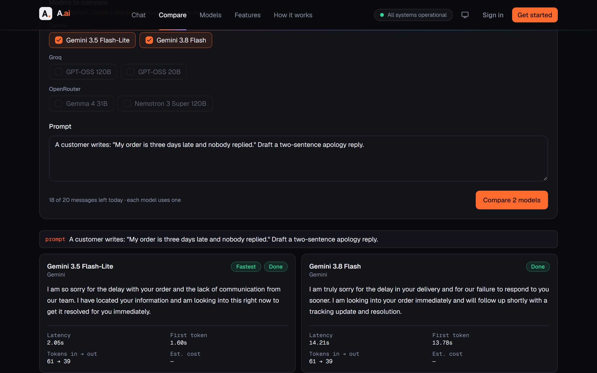
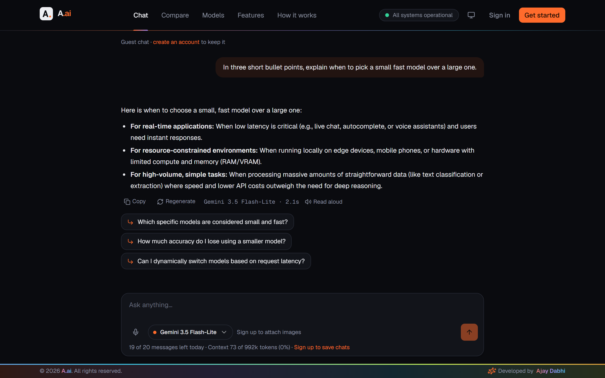
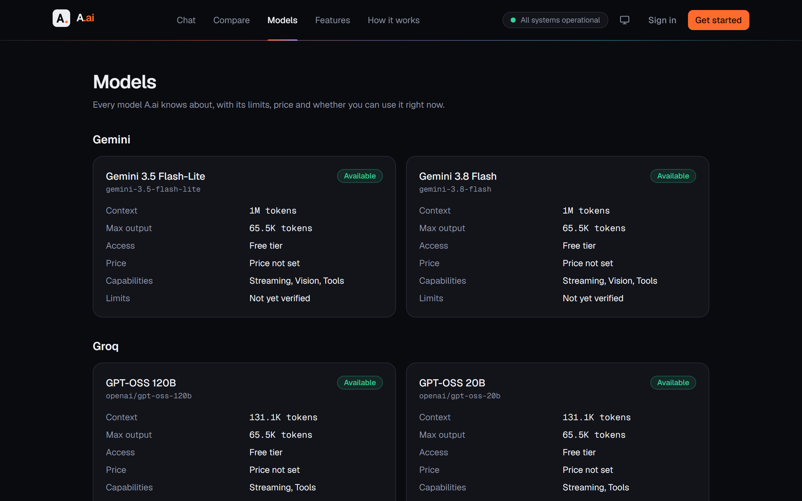
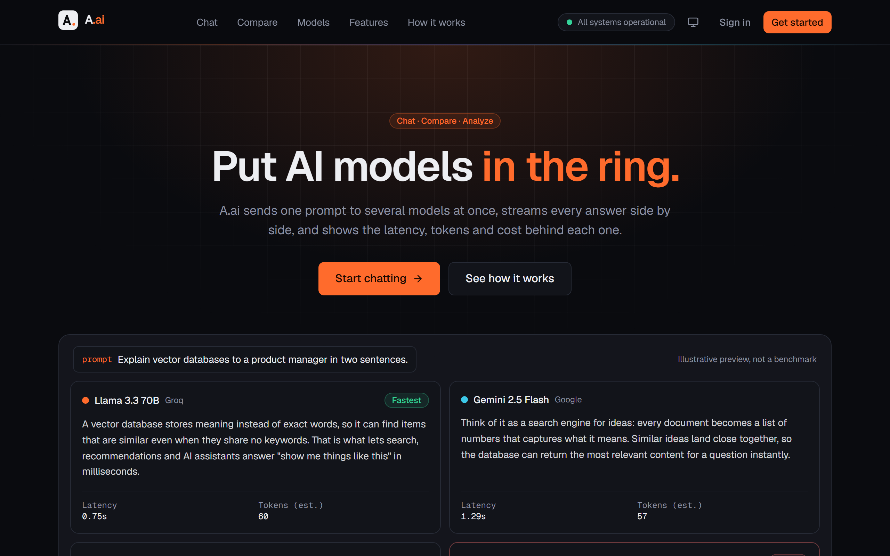
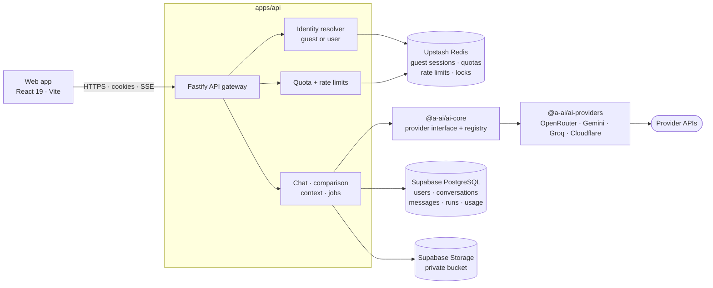
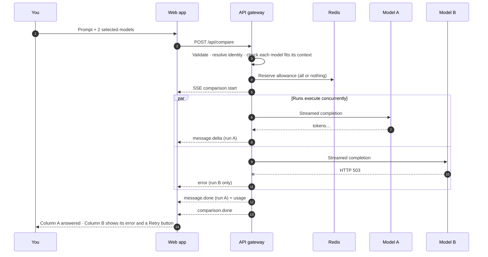
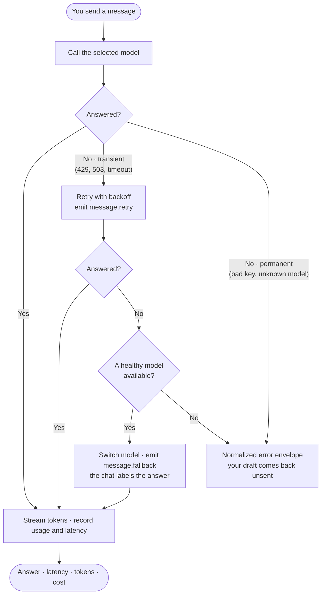
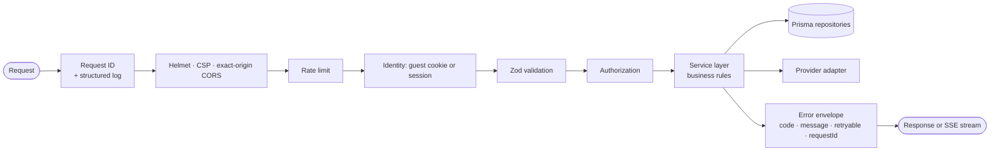
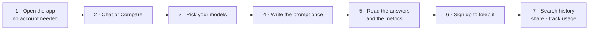
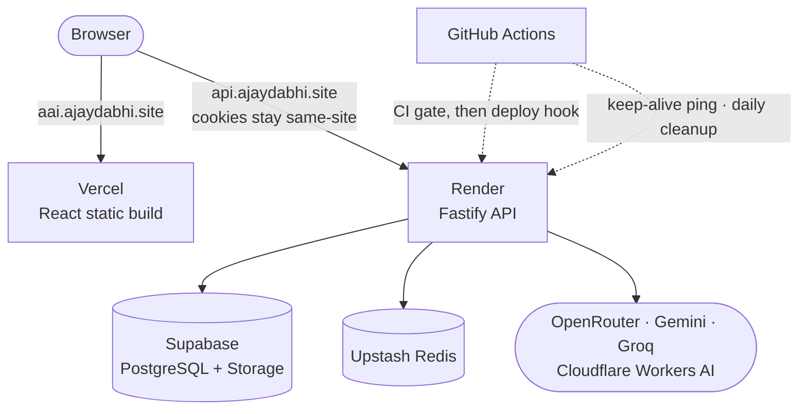

<div align="center">

# A.ai

**Put AI models in the ring.**

Send one prompt to several AI models at once, read their answers side by side, and decide with real latency, token and cost numbers in front of you.

[](https://github.com/Ajay-Dabhi-99/A.AI/actions/workflows/ci.yml)
[](LICENSE)


**[Try the live app](https://aai.ajaydabhi.site)** · no account needed · [How it works](#how-it-works) · [Use cases](#real-world-use-cases) · [Run it locally](#getting-started)

</div>



---

## Contents

- [The problem A.ai solves](#the-problem-aai-solves)
- [See it in action](#see-it-in-action)
- [Real-world use cases](#real-world-use-cases)
- [Feature set](#feature-set)
- [How it works](#how-it-works)
- [Using A.ai, step by step](#using-aai-step-by-step)
- [Tech stack](#tech-stack)
- [Getting started](#getting-started)
- [Configuration](#configuration)
- [Scripts](#scripts)
- [API reference](#api-reference)
- [Repository layout](#repository-layout)
- [Deployment](#deployment)
- [Project status](#project-status)
- [Documentation](#documentation)
- [Contributing](#contributing)
- [License](#license)

---

## The problem A.ai solves

Every product team now has to answer the same question: **which model should this feature use?** The honest answer depends on your prompts, not on a public leaderboard.

Today that comparison is done by hand: three browser tabs, three copies of the same prompt, a stopwatch, and a guess about cost. A.ai turns that into one screen.

| Without A.ai                                       | With A.ai                                                           |
| -------------------------------------------------- | ------------------------------------------------------------------- |
| Paste the prompt into three different chat windows | One prompt, up to four models, one click                            |
| "It felt faster" as the benchmark                  | Time to first token and total latency, measured per run             |
| Cost discovered on next month's invoice            | Input and output tokens, and estimated cost, shown on every answer  |
| One provider hiccup ends the session               | A failed model shows its own error card; the others keep streaming  |
| Findings live in a screenshot in a chat thread     | Every run is saved, searchable, reopenable and shareable via a link |

---

## See it in action

Every screenshot below is a real capture of the live deployment — real models, real answers, real timings.

### One prompt, several models, side by side


Pick your models, write the prompt once, and press **Compare**. Each column streams on its own and finishes with its own metrics: latency, time to first token, tokens in → out and estimated cost. The quickest column is tagged **Fastest**.

### Everyday chat, with the numbers still visible



Chat normally with one model. Under every answer you get the model that produced it, how long it took, and one-click **Copy**, **Regenerate** and **Read aloud**. A.ai then suggests follow-up questions, and the footer tracks your remaining daily messages and how much of the model's context window the conversation is using.

### A catalog that tells you what each model can do



One registry holds every model A.ai knows about, with its context window, maximum output, access tier, price and capabilities (streaming, vision, tools). Admins can enable or disable a model for everyone without a deploy.

### A landing page that shows the idea in five seconds



---

## Real-world use cases

### The worked example in the screenshot above

A support team asks both Gemini models to draft the same apology to a late customer. Both answers are good and almost identical in length — but:

| Model                 | Latency    | First token | Tokens in → out | Verdict                  |
| --------------------- | ---------- | ----------- | --------------- | ------------------------ |
| Gemini 3.5 Flash-Lite | **2.05 s** | 1.60 s      | 61 → 39         | Ship this one            |
| Gemini 3.8 Flash      | 14.21 s    | 13.78 s     | 61 → 39         | Same output, 7× the wait |

That is a decision you can defend in a design review, made in about twenty seconds. Without the numbers on screen, most teams would have picked the bigger model by reflex.

### Who uses it for what

| Role                   | The question they bring                        | How A.ai answers it                                                                                                         |
| ---------------------- | ---------------------------------------------- | --------------------------------------------------------------------------------------------------------------------------- |
| **Product engineer**   | Which model should power this feature?         | Run the ten prompts the feature will actually send; compare quality against latency and cost before writing the integration |
| **Support lead**       | Can a small model write our replies?           | Paste real tickets, compare tone and accuracy, and see whether the cheap model is good enough                               |
| **Founder / solo dev** | Am I overpaying for intelligence I don't need? | The cost and token columns make the gap between a flagship and a fast model concrete                                        |
| **Data analyst**       | Which model writes the most reliable SQL?      | Send the same schema and question to four models and read the queries next to each other                                    |
| **Content team**       | Which model matches our brand voice?           | Compare drafts side by side, then share a read-only link so the team can review without accounts                            |
| **Platform / SRE**     | Which provider is flaky right now?             | A failed column names the provider and error; `/ready` and the provider health endpoint report live status                  |
| **Learner or student** | How do these models actually differ?           | Guest mode: ask anything, no signup, and watch the differences appear in real time                                          |

### Three concrete sessions

1. **Choosing a summarizer.** Paste a 4,000-word transcript, select four models, compare. A.ai flags any model whose context window cannot fit the input _before_ spending a request, so you never pay for a guaranteed failure.
2. **Auditing a prompt change.** Run the old prompt, then the new one, against the same model. Both runs land in **History**, where you can reopen them side by side and see whether the rewrite actually cut tokens.
3. **Settling a team debate.** Compare, then publish the comparison as a share link. Reviewers open a read-only snapshot in the browser — no account, no screenshots pasted into chat.

---

## Feature set

### Compare and chat

| Feature                     | What it does                                                                                                                                                         |
| --------------------------- | -------------------------------------------------------------------------------------------------------------------------------------------------------------------- |
| **Side-by-side comparison** | One prompt to up to 4 models in parallel. Each run has its own abort controller and 120 s limit                                                                      |
| **Per-column failure**      | A model that times out or hits a rate limit shows its own error card with a **Retry** button; siblings keep streaming                                                |
| **No silent substitution**  | Comparison never swaps in a different model — that would compare the wrong thing                                                                                     |
| **Streaming chat**          | Token-by-token answers over SSE, cancellable mid-stream                                                                                                              |
| **Retry and fallback**      | In single-model chat, a transient provider failure is retried, then falls back to a healthy model — and the chat says it did                                         |
| **Message actions**         | Copy an answer or any code block, regenerate the latest answer, edit your latest question                                                                            |
| **Metrics on every run**    | Time to first token, total latency, input/output tokens, context use, estimated cost. Usage is labelled `provider` or `estimated`; unknown cost is `null`, never `0` |

### Accounts, history and sharing

| Feature                   | What it does                                                                                              |
| ------------------------- | --------------------------------------------------------------------------------------------------------- |
| **Guest mode**            | Full chat and comparison with no account, under a server-enforced daily limit                             |
| **Guest migration**       | Sign up and the guest conversation moves into your account instead of being lost                          |
| **Accounts**              | Email and password, email verification, password reset, and revocable sessions (`Log out everywhere`)     |
| **History**               | Search chats by what was said in them, with matches highlighted; filter, rename, pin and reopen           |
| **Dashboard**             | Runs, tokens, latency and estimated cost over time                                                        |
| **Share links**           | Publish a read-only snapshot of a chat that anyone with the link can open; revoke it at any time          |
| **Personal instructions** | Tell A.ai who you are and how to answer; every chat follows it                                            |
| **Personal suggestions**  | Pick up to three topics after signing in for tailored starter prompts, plus follow-ups after every answer |

### Multimodal and platform

| Feature                | What it does                                                                                                   |
| ---------------------- | -------------------------------------------------------------------------------------------------------------- |
| **Vision**             | Attach images for models that can see them; uploads go to a private bucket and are served by signed URL        |
| **Voice in**           | Dictate a message; speech-to-text runs on Groq Whisper (`whisper-large-v3-turbo`)                              |
| **Read aloud**         | Any answer can be spoken by the browser's speech engine                                                        |
| **Image generation**   | Signed-in users create images in the chat with FLUX.1 [schnell] on Cloudflare Workers AI, as resumable jobs    |
| **Video generation**   | Wired end to end as a background job, with no provider enabled — the app says so plainly instead of pretending |
| **Context management** | Conversations are trimmed to each model's token budget, with background summaries for long chats               |
| **Model registry**     | One catalog of models, capabilities and prices; admins enable or disable models without a deploy               |
| **Provider-agnostic**  | OpenRouter, Google Gemini and Groq sit behind one interface, so a new provider is a new adapter, not a new app |

### Limits (defaults, all configurable)

| Limit                  | Guest        | Signed in    | Environment variable                                     |
| ---------------------- | ------------ | ------------ | -------------------------------------------------------- |
| Messages per day       | 20           | 200          | `GUEST_DAILY_MESSAGE_LIMIT` / `USER_DAILY_MESSAGE_LIMIT` |
| Models per comparison  | 2            | 4            | `GUEST_COMPARE_MAX_MODELS` / `USER_COMPARE_MAX_MODELS`   |
| Image upload           | —            | 5 MB         | `ATTACHMENT_MAX_BYTES`                                   |
| Voice input            | 10 MB, 120 s | 10 MB, 120 s | `AUDIO_MAX_BYTES`                                        |
| Conversation retention | Redis TTL    | Permanent    | `GUEST_SESSION_TTL_MINUTES`                              |

In a comparison, **each model costs one message**, and the allowance is checked all-or-nothing before any provider is called.

---

## How it works

### Architecture



The web app never holds a provider key and never imports server code — ESLint enforces the boundary. Every provider call goes through the gateway, so quotas, context limits and the error envelope apply no matter which model you picked.

### What happens when you send one prompt to several models



`Promise.allSettled`, never `Promise.all`: one provider having a bad minute cannot take the other columns down with it.

### What happens when a single chat model fails



Fallback happens **only in single-model chat**. In comparison mode a failed column stays failed, because a substituted model would answer a different question than the one being compared.

### Request lifecycle inside the gateway



Routes stay thin — validate, identify, authorize, call a service, map the result. Business rules live in services, persistence behind repositories, and provider HTTP inside `packages/ai-providers`. Unknown errors become `INTERNAL_ERROR` and never leak a message.

---

## Using A.ai, step by step



**1. Open [aai.ajaydabhi.site](https://aai.ajaydabhi.site).** You are a guest immediately — no signup wall. The API runs on a free instance that sleeps after 15 idle minutes, so the very first request of the day can take up to a minute; the app retries it for you and shows that it is waking up.

**2. Just chat, or go straight to Compare.** `Chat` is a normal assistant with one model. `Compare` is the side-by-side view.

**3. Pick your contenders.** On the compare page, tick the models you want — 2 as a guest, 4 when signed in. The whole catalog stays on screen once you reach your limit, greyed out rather than hidden, so you can always see what you are missing.

**4. Write the prompt once.** Use a prompt you actually care about — a real support ticket, a real SQL question, a real product description. Generic prompts produce generic differences.

**5. Read the answers and the numbers.** Columns stream in parallel. When each finishes you get latency, time to first token, tokens in → out and estimated cost, and the quickest column is tagged **Fastest**. If a column fails, its error card names the provider and the reason, and **Retry** re-runs that model alone.

**6. Sign up when you want to keep something.** Your guest conversation migrates into the new account. The daily limit goes from 20 to 200 messages and comparisons go from 2 to 4 models.

**7. Then use the workspace.** Search chats by their contents, pin and rename them, reopen any past comparison, publish a read-only share link, set personal instructions that apply to every chat, and watch runs, tokens, latency and cost on the dashboard.

> **Tip:** the fastest way to evaluate a model for production is to compare it against the model you use today, on ten prompts from your real logs. The latency column usually decides it.

---

## Tech stack

| Layer           | Choice                                                                                                  |
| --------------- | ------------------------------------------------------------------------------------------------------- |
| Web             | React 19, TypeScript, Vite, Tailwind CSS v4, TanStack Query, Zustand, React Router 7, Motion            |
| API             | Fastify 5, TypeScript, Zod 4, Server-Sent Events                                                        |
| Database        | Supabase PostgreSQL via Prisma 7 (pg driver adapter), Row Level Security on every table                 |
| Ephemeral state | Upstash Redis — guest sessions, quotas, rate limits, locks (mandatory, no in-memory substitute)         |
| File storage    | Supabase Storage (private bucket, signed URLs)                                                          |
| Email           | Resend                                                                                                  |
| AI providers    | OpenRouter, Google Gemini, Groq (chat) · Groq Whisper (speech-to-text) · Cloudflare Workers AI (images) |
| Monorepo        | pnpm workspaces + Turborepo                                                                             |
| Tests           | Vitest (unit + integration), Playwright (browser smoke), a live suite against real infrastructure       |
| CI / hosting    | GitHub Actions · Vercel (web) · Render (API)                                                            |

Docker is not used anywhere in this project — see [ADR-005](docs/decisions/ADR-005-infrastructure.md).

---

## Getting started

### Prerequisites

| Requirement                                      | Why                                                                                                                                       |
| ------------------------------------------------ | ----------------------------------------------------------------------------------------------------------------------------------------- |
| Node.js **22.13+**                               | `node -v`                                                                                                                                 |
| pnpm **10**                                      | `npm install -g pnpm@10`                                                                                                                  |
| A [Supabase](https://supabase.com) project       | PostgreSQL and file storage                                                                                                               |
| An [Upstash](https://upstash.com) Redis database | Sessions, quotas and rate limits — mandatory                                                                                              |
| At least one provider key                        | [OpenRouter](https://openrouter.ai), [Gemini](https://aistudio.google.com) or [Groq](https://console.groq.com); all three have free tiers |
| _Optional_ [Resend](https://resend.com) key      | To send real verification emails. Without it, emails are printed in the API log                                                           |
| _Optional_ Cloudflare Workers AI                 | To enable in-chat image generation                                                                                                        |

### Install

```bash
git clone https://github.com/Ajay-Dabhi-99/A.AI.git
```

```bash
cd A.AI
```

```bash
pnpm install
```

### Configure

Copy `.env.example` to `.env` in the repository root and fill it in — the file documents where every value comes from. Then validate it (values are never printed):

```bash
pnpm check:env
```

### Create the database

```bash
pnpm db:deploy
```

```bash
pnpm db:seed
```

`db:deploy` applies the migrations; `db:seed` inserts the default model registry and never overwrites edits you made through the admin UI.

### Run

```bash
pnpm dev
```

| Service | URL                                         |
| ------- | ------------------------------------------- |
| Web     | http://localhost:5180                       |
| API     | http://localhost:4000 (`/health`, `/ready`) |

Ports 4000 and 5180 are deliberate: they stay out of the way of other local projects on 3000, 5000 and 5173. In development the Vite dev server proxies `/api` to the API, so leave `VITE_API_URL` empty and session cookies stay first-party.

### Grant yourself admin

There is no API for this on purpose — admin is granted from the command line only:

```bash
pnpm admin:promote you@example.com
```

---

## Configuration

Every variable is declared and validated in `packages/config/src/server.ts` (API) or `web.ts` (browser). The API refuses to start on an invalid configuration rather than failing later at runtime.

| Group         | Variables                                                                                                                                                                    |
| ------------- | ---------------------------------------------------------------------------------------------------------------------------------------------------------------------------- |
| Runtime       | `NODE_ENV`, `HOST`, `PORT`, `LOG_LEVEL`, `TRUST_PROXY_HOPS`                                                                                                                  |
| URLs & CORS   | `APP_URL`, `CORS_ORIGIN`, `API_PROXY_TARGET`, `VITE_API_URL`                                                                                                                 |
| Database      | `DATABASE_URL` (pooled), `DIRECT_URL` (migrations)                                                                                                                           |
| Redis         | `REDIS_URL`                                                                                                                                                                  |
| Auth          | `JWT_SECRET`, `GUEST_SESSION_TTL_MINUTES`                                                                                                                                    |
| Email         | `RESEND_API_KEY`, `EMAIL_FROM`                                                                                                                                               |
| Storage       | `SUPABASE_URL`, `SUPABASE_SERVICE_ROLE_KEY`, `SUPABASE_STORAGE_BUCKET`                                                                                                       |
| AI providers  | `OPENROUTER_API_KEY`, `GEMINI_API_KEY`, `GROQ_API_KEY`, `CLOUDFLARE_ACCOUNT_ID`, `CLOUDFLARE_AI_API_TOKEN`                                                                   |
| Limits        | `GUEST_DAILY_MESSAGE_LIMIT`, `USER_DAILY_MESSAGE_LIMIT`, `GUEST_COMPARE_MAX_MODELS`, `USER_COMPARE_MAX_MODELS`, `ATTACHMENT_MAX_BYTES`, `AUDIO_MAX_BYTES`, `VIDEO_MAX_BYTES` |
| Features      | `CHAT_FALLBACK_ENABLED`, `CHAT_SUGGESTIONS_ENABLED`, `CONTEXT_SUMMARY_ENABLED`                                                                                               |
| Observability | `SENTRY_DSN`, `SENTRY_ENVIRONMENT`, `VITE_SENTRY_DSN`, `RENDER_GIT_COMMIT`                                                                                                   |
| Tests         | `TEST_DATABASE_URL`, `TEST_DIRECT_URL`, `TEST_REDIS_URL`, `SMOKE_API_URL`, `SMOKE_WEB_ORIGIN`                                                                                |

Adding a variable means updating the config contract, `.env.example` and the docs **in the same change**.

---

## Scripts

| Command                    | What it does                                                                               |
| -------------------------- | ------------------------------------------------------------------------------------------ |
| `pnpm dev`                 | API (watch) and web dev server together                                                    |
| `pnpm verify`              | Format check → lint → typecheck → unit + integration tests → build                         |
| `pnpm test:unit`           | Fast unit tests across every workspace                                                     |
| `pnpm test:integration`    | Fastify routes end to end with controlled DB/Redis adapters                                |
| `pnpm test:live`           | Real Supabase + Upstash checks (needs `TEST_DATABASE_URL`, `TEST_REDIS_URL`)               |
| `pnpm test:e2e`            | Playwright browser smoke with a mocked API (needs Chromium)                                |
| `pnpm check:env`           | Validates `.env` without printing any value                                                |
| `pnpm db:migrate`          | Create and apply a Prisma migration (development)                                          |
| `pnpm db:deploy`           | Apply pending migrations (CI / production)                                                 |
| `pnpm db:seed`             | Insert the default model registry (never overwrites edits)                                 |
| `pnpm admin:promote`       | `pnpm admin:promote <email> [--revoke]` — grant or remove the admin role                   |
| `pnpm attachments:cleanup` | Delete image uploads never sent within 24 hours (runs daily in CI)                         |
| `pnpm smoke`               | `pnpm smoke --api <url> [--web <origin>]` — check a deployed release; calls no AI provider |

---

## API reference

Everything lives under `/api`, returns JSON, and streams with Server-Sent Events where a response is progressive. Full request and response shapes are in [docs/api](docs/api/).

| Area        | Endpoints                                                                                                                                                                   |
| ----------- | --------------------------------------------------------------------------------------------------------------------------------------------------------------------------- |
| Health      | `GET /health` · `GET /ready`                                                                                                                                                |
| Auth        | `POST /api/auth/signup` · `login` · `logout` · `logout-all` · `verify-email` · `resend-verification` · `forgot-password` · `reset-password`                                 |
| Account     | `GET /api/me` · `PATCH /api/me/profile` · `/api/me/interests` · `GET                                                                                                        | PATCH /api/me/instructions`                                            |
| Chat        | `POST /api/chat` (SSE) · `POST /api/chat/suggestions` · `GET /api/conversations` · `GET /api/conversations/search` · `GET                                                   | DELETE /api/conversations/:id`                                         |
| Sharing     | `POST                                                                                                                                                                       | DELETE /api/conversations/:id/share`·`GET /api/shared/:token` (public) |
| Comparison  | `POST /api/compare` (SSE) · `POST /api/compare/:id/runs` · `GET                                                                                                             | DELETE /api/comparisons/:id`                                           |
| History     | `GET /api/history` · `GET /api/conversations/:id/runs` · `GET /api/usage`                                                                                                   |
| Models      | `GET /api/models` · `GET /api/models/catalog` · `GET /api/providers/health`                                                                                                 |
| Admin       | `GET /api/admin/models` · `PATCH /api/admin/models/:registryId` · `GET /api/admin/usage`                                                                                    |
| Attachments | `POST /api/attachments` · `GET /api/attachments/:id/url`                                                                                                                    |
| Media jobs  | `GET /api/image/status` · `/api/video/status` · `POST /api/image/generate` · `GET /api/jobs` · `/api/jobs/:id` · `/api/jobs/:id/events` (SSE) · `POST /api/jobs/:id/cancel` |
| Audio       | `GET /api/audio/status` · `POST /api/audio/transcriptions`                                                                                                                  |
| Guest       | `GET                                                                                                                                                                        | DELETE /api/guest/conversation`·`POST /api/guest/migrate`              |

### Stream events

Chat and comparison speak the same event vocabulary, so the client renders them with the same code:

| Event              | Meaning                                                               |
| ------------------ | --------------------------------------------------------------------- |
| `message.start`    | A run began — run id, provider, model, and the context that was built |
| `message.delta`    | A chunk of text                                                       |
| `message.retry`    | A transient failure; the same model is being retried                  |
| `message.fallback` | The model was swapped for a healthy one (single-model chat only)      |
| `usage`            | Token counts, labelled `provider` or `estimated`                      |
| `message.done`     | Terminal state for that run, with latency                             |
| `error`            | That run failed — the envelope below, for one run only                |

### Error envelope

Every client-facing failure has the same shape, defined once in `packages/shared-types/src/errors.ts`:

```json
{
  "error": {
    "code": "QUOTA_EXCEEDED",
    "message": "You have used all 20 messages for today.",
    "retryable": false,
    "requestId": "6f0b3d0a-6c3e-4f2a-9b5e-4b0c1a2d3e4f"
  }
}
```

`VALIDATION_ERROR` · `AUTH_REQUIRED` · `INVALID_CREDENTIALS` · `EMAIL_NOT_VERIFIED` · `TOKEN_INVALID` · `FORBIDDEN` · `NOT_FOUND` · `RATE_LIMITED` · `QUOTA_EXCEEDED` · `CONTEXT_TOO_LARGE` · `MODEL_UNAVAILABLE` · `PROVIDER_TIMEOUT` · `PROVIDER_BAD_RESPONSE` · `INTERNAL_ERROR`

`requestId` is echoed in the response headers and appears in the server log line for that request, so a user-reported error can be traced in one search.

---

## Repository layout

```
apps/
  web/                  React app — presentation, client state, data fetching
  api/                  Fastify gateway — identity, quotas, orchestration, SSE
packages/
  shared-types/         Canonical API, AI, error and health types
  ai-core/              Provider interface, registry, provider error type
  ai-providers/         HTTP/SSE plumbing and the provider adapters
  validation/           Browser-safe Zod schemas shared by both apps
  config/               Typed environment contracts + shared tsconfig
prisma/                 Schema, migrations, seed
scripts/                check-env · promote-admin · cleanup-attachments · smoke
docs/
  architecture/         How each subsystem works
  api/                  Endpoint reference
  decisions/            ADR-001 … ADR-017
  development/          Phases, roadmap, deployment and release guides
  images/               The screenshots in this README
```

Workspace packages resolve from source in development through the `@a-ai/source` export condition, and from `dist` in builds. The web app is forbidden by ESLint from importing `@a-ai/ai-core`, `@a-ai/ai-providers` or `@a-ai/config/server`.

---

## Deployment



The live deployment runs on free plans, and the repository is honest about what that costs:

- **Cold starts.** A free Render instance sleeps after 15 idle minutes and needs 20–60 s to wake. `.github/workflows/keep-alive.yml` pings `/health` every 5 minutes during the day, and the web client retries the gateway errors a boot produces.
- **No preDeploy hook.** Migrations are applied with `pnpm db:deploy` _before_ the deploy hook fires, not by Render.
- **No cron.** `.github/workflows/cleanup.yml` runs the daily attachment cleanup on the schedule Render's cron service would have used.
- **Cookies.** The app and the API are two hosts on one registrable domain — `aai.ajaydabhi.site` and `api.ajaydabhi.site` — so the API's `__Host-` session cookies are same-site and ride along with every credentialed request. `vercel.json` keeps an `/api/*` rewrite to the same API as a fallback path for a build without `VITE_API_URL`. On the default hosts (`*.vercel.app` calling `*.onrender.com`) the cookies would be cross-site and browsers would drop the session.

Moving to paid plans means setting `plan: starter` in [`render.yaml`](render.yaml), restoring `preDeployCommand` and the cron service, and disabling those two workflows. Step-by-step guides: [deployment-guide.md](docs/development/deployment-guide.md) (with a custom domain) and [A.ai-Free-Hosting-Guide.pdf](docs/development/A.ai-Free-Hosting-Guide.pdf) (without one).

---

## Project status

**Live in production** at **[aai.ajaydabhi.site](https://aai.ajaydabhi.site)**, with the API on Render at `api.ajaydabhi.site`, PostgreSQL and file storage on Supabase and Redis on Upstash.

| Signal               | State                                                                                                                                                                                                 |
| -------------------- | ----------------------------------------------------------------------------------------------------------------------------------------------------------------------------------------------------- |
| Feature phases 0–10  | Code complete and deployed — see the [roadmap](docs/development/roadmap.md) for per-phase evidence                                                                                                    |
| CI on every push     | Format, lint, typecheck, unit, integration, build, plus a Playwright browser smoke — green                                                                                                            |
| Production readiness | `GET /ready` reports PostgreSQL up, Redis up and three providers configured                                                                                                                           |
| Chat and comparison  | Verified against all three providers, including a real retry, a real fallback and a real per-column failure                                                                                           |
| Speech-to-text       | Verified end to end on Groq Whisper                                                                                                                                                                   |
| Image generation     | Enabled in production on Cloudflare Workers AI (FLUX.1 [schnell])                                                                                                                                     |
| Video generation     | Plumbed as a background job, no provider enabled — the app says so instead of pretending                                                                                                              |
| Known constraints    | Free-tier cold start (covered by keep-alive and client retry); free OpenRouter models are shared upstream and can be rate-limited, which is exactly what the retry and per-column error paths are for |

The tracker in [docs/development/roadmap.md](docs/development/roadmap.md) is the authoritative, unvarnished record: what is verified, with which command, and what still needs a human in front of a browser.

---

## Documentation

| Document                                                                | What you will find                           |
| ----------------------------------------------------------------------- | -------------------------------------------- |
| [Learning guide](docs/development/learning-guide.md)                    | What each phase builds and where it lives    |
| [Roadmap and tracker](docs/development/roadmap.md)                      | Phase-by-phase status with test evidence     |
| [System architecture](docs/architecture/system-architecture.md)         | Components, request path, health model       |
| [Repository architecture](docs/architecture/repository-architecture.md) | Why the workspace is split the way it is     |
| [Comparison engine](docs/architecture/comparison-engine.md)             | The rules behind the side-by-side view       |
| [Context management](docs/architecture/context-management.md)           | Token budgets, trimming and summaries        |
| [Provider abstraction](docs/architecture/provider-abstraction.md)       | How a new provider is added                  |
| [Guest mode](docs/architecture/guest-mode.md)                           | Identity, TTLs and migration on signup       |
| [API reference](docs/api/)                                              | Every endpoint, event and error              |
| [Architecture decisions](docs/decisions/)                               | ADR-001 to ADR-017, including why not Docker |
| [Deployment guide](docs/development/deployment-guide.md)                | Zero to production, step by step             |
| [Deployment, backups and rollback](docs/development/deployment.md)      | Operating it once it is live                 |
| [Release checklist](docs/development/release-checklist.md)              | The gate before a deploy                     |
| [Security review](docs/development/security-review.md)                  | Findings and what was done about them        |
| [Blueprint review](docs/development/blueprint-review.md)                | Where the original plan was wrong, and why   |

The original implementation blueprint is in [docs/blueprint](docs/blueprint/). It was written under the working name _ModelArena_; the product is **A.ai** — see [ADR-007](docs/decisions/ADR-007-product-name.md).

---

## Contributing

Work is tracked as `MODEL-XXX` tasks.

1. Open an issue from the **Implementation task** or **Defect** template.
2. Branch per task, one bounded concern at a time.
3. Commit with [Conventional Commits](https://www.conventionalcommits.org) and reference the task ID — `feat(chat): add regenerate (MODEL-068)`.
4. Open a pull request using the [PR template](.github/pull_request_template.md).
5. `pnpm verify` must pass. So must CI.

House rules worth knowing before your first PR: routes stay thin, every client-facing error uses the shared envelope, every new table gets Row Level Security, and a new environment variable updates the config contract, `.env.example` and the docs in the same change. The full set is in [CLAUDE.md](CLAUDE.md).

---

## License

[MIT](LICENSE) © 2026 Dabhi Ajay
