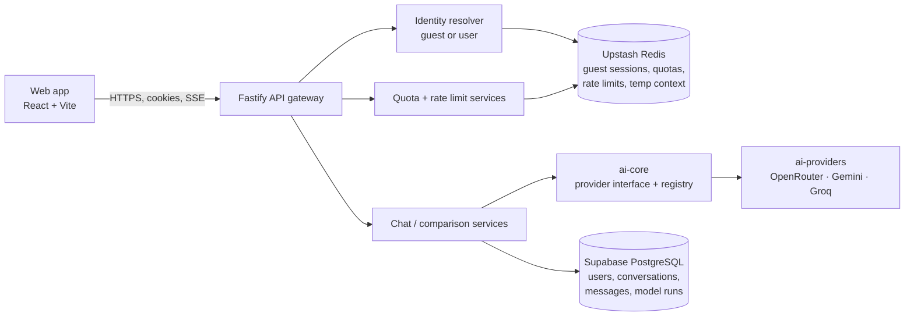

# System architecture

## Components

| Component                | Responsibility                                                                            | Status                                                         |
| ------------------------ | ----------------------------------------------------------------------------------------- | -------------------------------------------------------------- |
| Web app (`apps/web`)     | Rendering, interaction state, data fetching, accessibility. Never holds provider secrets. | Phase 0 shell + landing page                                   |
| API gateway (`apps/api`) | Validation, identity, quotas, orchestration, normalized errors, SSE                       | Phase 0 platform + health                                      |
| Supabase PostgreSQL      | Durable data: users, conversations, messages, runs, usage                                 | Connection + readiness (Phase 0); tables from Phase 1          |
| Upstash Redis            | Guest sessions (TTL), quotas, rate limits, temporary context, locks                       | Client + readiness (Phase 0); keys from Phase 1                |
| Provider adapters        | Map normalized requests to each provider and back                                         | Interface + HTTP/SSE plumbing (Phase 0); adapters from Phase 2 |

## Request path (blueprint §4)

1. The browser sends a request with its guest or user session cookie.
2. The identity resolver decides who is calling (Phase 1).
3. The quota and rate-limit services check allowance in Redis before any provider work (Phase 1).
4. The chat service builds a bounded context within the model's token budget (Phase 2, hardened in Phase 5).
5. The provider registry returns the adapter for the requested model.
6. The adapter streams tokens; the API re-emits them as normalized SSE events.
7. Usage and latency are recorded; user runs persist to PostgreSQL, guest data stays in Redis with a TTL.
8. The browser receives the same event and error shapes regardless of provider.

## What exists after Phase 0

Every request already goes through the platform layer in this order (`apps/api/src/app.ts`):

1. **Observability**: request ID from a safe `x-request-id` header or a new UUID, echoed in the response header; one structured log line per request with method, route, status and latency.
2. **Error envelope**: any thrown error becomes `{ error: { code, message, retryable, requestId } }`. Unknown errors never leak their message.
3. **Security**: helmet headers, a locked-down CSP for a JSON API, exact-origin CORS with credentials.
4. **Infrastructure**: Prisma client (Supabase, pooled URL, lazy connect) and ioredis client (Upstash, TLS, capped reconnect backoff), both closed on shutdown.
5. **Routes**: `GET /health` (liveness) and `GET /ready` (Supabase, Upstash and provider configuration).

## Health model

- `/health` never touches dependencies. A load balancer uses it to decide whether the process is alive.
- `/ready` probes PostgreSQL (`SELECT 1`) and Redis (`PING`) in parallel with a 2-second timeout each, and checks that at least one provider key is configured. Any failure returns 503. Redis being down is a readiness failure because Redis is mandatory (blueprint v4 §14).
- Probe failures return a generic reason (`unreachable`, `timed out after 2000ms`). The server logs the error name and code, never connection strings.

## Deployment topology (Phase 10)

- Web on Vercel. API on Render (or another managed Node host). Supabase PostgreSQL. Upstash Redis.
- Serve web and API from the **same site** (for example `app.a.ai` and `api.a.ai`) so session cookies are first-party. See [blueprint review](../development/blueprint-review.md#1-cross-site-cookies-will-break-login-on-safari).
